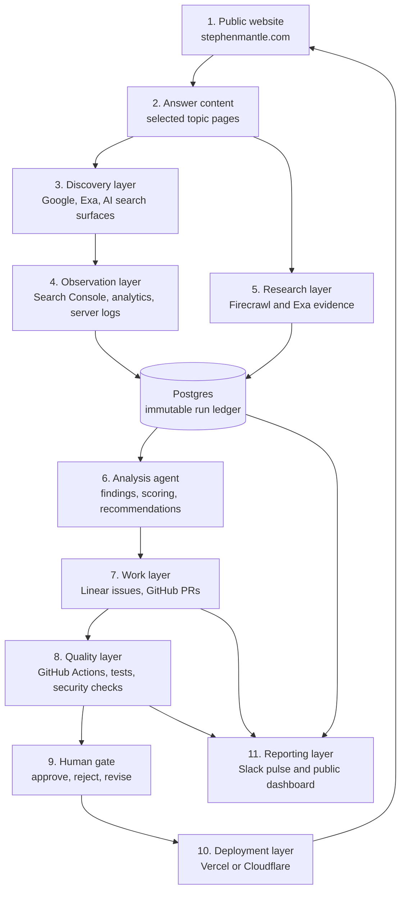
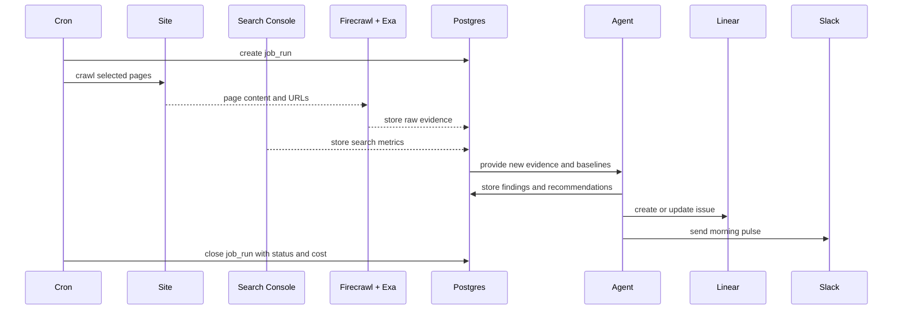

# AEO Growth Loop

## Reviewable implementation plan

**Project type:** public AEO experimentation system for `stephenmantle.com`

**Working name:** AEO Growth Loop

**Dashboard name:** AEO Observatory

**Primary promise:** publish useful answers, measure whether search and AI systems discover and cite them, record the resulting visits and evidence, propose reviewed improvements, then measure the next version.

---

## 1. The project in one sentence

This is a public website, database, agent, dashboard, repository, and CI/CD workflow that turns AEO evidence into reviewed site improvements.

It is not a bot that manufactures traffic. It creates useful content, makes that content easy to discover and cite, measures the outcome, and learns from the evidence.

---

## 2. Product boundaries

### The full product: AEO Growth Loop

Owns the complete cycle:

1. Choose a topic.
2. Publish a useful answer.
3. Make the answer crawlable and understandable.
4. Test discovery and extraction.
5. Measure citations, search visibility, and human visits.
6. Find weaknesses.
7. Create an evidence-backed recommendation.
8. Open a Linear issue.
9. Draft a GitHub change.
10. Run CI checks.
11. Require human approval.
12. Deploy and retest.

### AEO Observatory

The Observatory is the monitoring layer. It shows:

- topics
- pages
- crawl runs
- citation checks
- search metrics
- traffic metrics
- findings
- experiments
- agent runs
- pull requests
- deployments
- failures
- costs

### Public case study

The public case study explains the machine in plain language. It shows the evidence trail without exposing private credentials, raw provider payloads, private Slack messages, or personal analytics.

---

## 3. What success means

### Primary outcome

More qualified visitors reach selected answer pages from search and AI-assisted discovery.

### Secondary outcomes

- More target-topic impressions in Search Console
- More clicks to selected pages
- More observed citations across a fixed test set
- Better answer extraction by research tools
- More visitors clicking to work, contact, or GitHub pages
- Faster movement from finding to reviewed change
- Fewer repeated technical/content issues

### Guardrails

- No mass-produced thin pages
- No automatic publishing to production
- No unreviewed outreach
- No fabricated performance claims
- No exposing secrets or private visitor data
- No single “AEO score” hiding weak evidence

Google’s current guidance treats generative search visibility as an extension of strong search fundamentals. It also warns against creating large amounts of content mainly to manipulate search or AI responses. The system should therefore optimise for useful, evidence-led pages, not page volume. [Google generative AI search guidance](https://developers.google.com/search/docs/fundamentals/ai-optimization-guide)

---

## 4. Layer map



### Layer ownership

| Layer | Job | Public proof |
|---|---|---|
| Website | Answer questions and convert attention into interest | Live page on `stephenmantle.com` |
| Answer content | Give AI/search systems clear, useful source material | Topic pages and case studies |
| Discovery | Find whether pages are discoverable | Search and research evidence |
| Observation | Record actual visibility and visits | Sanitised metrics dashboard |
| Research | Inspect pages and competing sources | Evidence links and snapshots |
| Agent | Convert evidence into decisions | Finding record and explanation |
| Work | Turn decisions into tracked work | Linear issue and GitHub PR |
| Quality | Stop unsafe or broken changes | CI checks and deployment result |
| Human gate | Protect quality and reputation | Approval history |
| Deployment | Ship approved improvements | Deployment record |
| Reporting | Make the system understandable | Public run log and Slack pulse |

---

## 5. Tool map

Use many tools, but give each tool one clear job.

| Tool | Role | What it demonstrates |
|---|---|---|
| Next.js + TypeScript | Public site and dashboard | Modern full-stack frontend |
| Vercel | First deployment target and web runtime | Production hosting, previews, cron |
| Cloudflare Workers | Optional worker runtime for longer jobs | Edge/background architecture |
| Postgres | Durable evidence and experiment store | Relational data design |
| Kysely | Typed SQL access layer | Backend data discipline |
| Firecrawl | Crawl and extract known pages | Web extraction and structured evidence |
| Exa | Semantic discovery and topic research | AI-native search workflows |
| Google Search Console API | Search impressions, clicks, queries, CTR, position | Actual search performance |
| Analytics | Human sessions, referrals, conversions | Actual visitor behaviour |
| Claude or another model provider | Analysis and recommendation agent | Agent orchestration |
| Linear | Findings, issues, acceptance criteria | Product operations |
| GitHub | Public source repository and review history | Open engineering practice |
| GitHub Actions | Tests, security, build, preview checks | CI/CD discipline |
| Slack | Operator notification and daily pulse | Business-facing automation |
| Sentry or equivalent | Runtime errors and failed jobs | Production reliability |

### Tool rule

Do not add a tool because it looks impressive. Add it only when it creates a visible capability:

```text
tool → owned job → stored record → visible proof
```

Example:

```text
Firecrawl → extract page structure → crawl_pages table → evidence panel
```

### Zapier integration boundary

Zapier is an integration bridge, not the AEO LOOP database and not the authoritative scheduler. The recommended v1 arrangement is:

```text
Vercel Cron → AEO LOOP API → Postgres run/finding/outbox state
                              ↓ signed, idempotent webhook
                         Zapier workflow
                         ├─ create/update Linear issue
                         ├─ send Slack pulse
                         └─ optional email or operator action
                              ↓ callback/status poll
                         AEO LOOP delivery status
```

There are two separate Zapier surfaces:

1. **Zapier MCP for development/operator work.** The agent can use explicitly enabled, least-privilege actions such as inspecting a connection, sending a test Slack message, or creating a test Linear issue. These actions are not the deployed runtime.
2. **Zapier runtime webhook or SDK integration.** The deployed AEO LOOP app sends a signed event after a finding is stored. Zapier performs the external actions, and the app records the delivery status and external IDs. This keeps the database authoritative even if Zapier is delayed or unavailable.

The first Zapier workflow should be:

```text
finding.created → validate event schema → Linear issue → Slack pulse → callback delivery result
```

Required event fields are `eventId`, `findingId`, `runId`, `topic`, `summary`, `confidence`, `dashboardUrl`, `linearAction`, and `createdAt`. `eventId` is the idempotency key. No raw provider payloads, visitor-level analytics, API keys, or private prompts are sent to Zapier.

Zapier MCP is now connected in the Codex session (checked 2026-08-25). Linear is enabled and authenticated; Slack is discoverable but its actions still need to be enabled on this server. Before implementation, enable only the required Slack action and test both actions in a non-production destination. Zapier's official MCP documentation describes adding individual tools and testing the connection by asking the client to list available tools; its webhook actions support receiving and sending JSON events. [Zapier MCP quickstart](https://docs.zapier.com/mcp/quickstart) · [Zapier webhooks](https://zapier.com/apps/webhook/integrations)
---

## 6. Initial topic experiment

Start with three topics. Three topics create a complete test without creating a content factory.

### Topic A

**How can a website designer build a self-improving website?**

Target page: `/insights/self-improving-website`

### Topic B

**How do GitHub, Linear, and Slack work together in a website improvement loop?**

Target page: `/insights/github-linear-slack-website-loop`

### Topic C

**What is the difference between SEO and AEO for a personal portfolio?**

Target page: `/insights/seo-vs-aeo-portfolio`

### Each page must contain

- Direct answer in the opening section
- Clear H2 questions
- Your own practical experience
- Evidence and links
- Specific examples from the project
- Author name and update date
- Canonical URL
- Related project links
- A clear next action

### Test set per topic

Create 10 prompt variants per topic:

- definition prompt
- comparison prompt
- implementation prompt
- employer/recruiter prompt
- beginner prompt
- expert prompt
- “best approach” prompt
- “how does this work” prompt
- problem-solving prompt
- follow-up prompt

The system records the prompt, date, provider/surface, returned sources, citation presence, cited URL, and confidence.

---

## 7. Research and measurement model

Firecrawl and Exa are test instruments. They do not represent all external AI traffic.

### Firecrawl tests

- Can the page be fetched?
- Can the main content be extracted?
- Are headings clear?
- Are links present?
- Is structured data present?
- Is important content hidden behind client-side rendering?

### Exa tests

- Does the topic retrieve relevant pages?
- Does the target page appear?
- Which competing pages appear first?
- What language and evidence do those pages use?
- Which subtopics are associated with the question?

### Search Console tests

- Are impressions increasing?
- Are clicks increasing?
- Which queries show the page?
- Which pages have high impressions but low CTR?
- Which page/query pairs deserve a new experiment?

### Visitor analytics tests

- Did a person visit from search or an AI-linked referral?
- Which answer page did they enter through?
- Did they click to work, GitHub, contact, or resume pages?
- Did they return?

### Citation tests

- Was the site mentioned as a source?
- Was the correct page cited?
- Was the citation link clickable?
- Was the answer accurate?
- Did citation status change after the experiment?

Citation checks are observations, not guarantees. Results vary by provider, query wording, geography, date, model, and index state.

---

## 8. Database design

The database is the system memory. Raw evidence should be preserved. Derived conclusions should be versioned. Human decisions should never overwrite the original agent decision.

### Core tables

| Table | Records |
|---|---|
| `projects` | AEO Growth Loop and future project areas |
| `topics` | Target questions, intent, status, owner |
| `pages` | URLs, titles, content type, canonical URL, last change |
| `topic_pages` | Which pages answer which topics |
| `crawl_runs` | Each Firecrawl site/page run |
| `crawl_pages` | Extracted metadata, headings, links, schema, hashes |
| `research_runs` | Each Exa search batch and query version |
| `research_results` | Returned URLs, titles, snippets, highlights, rank |
| `citation_checks` | Prompt, surface, answer, citation, cited URL, timestamp |
| `search_metrics` | Search Console daily metrics by page/query |
| `traffic_metrics` | Sessions, referrals, page views, conversions |
| `findings` | Evidence-backed problems and opportunities |
| `experiments` | Hypothesis, change, baseline, result, conclusion |
| `agent_runs` | Prompt version, model, input records, output, cost, status |
| `work_items` | Linear issue, GitHub PR, status, links |
| `deployments` | Commit, environment, deployment status, timestamp |
| `audit_events` | Immutable record of important actions |
| `job_runs` | Cron state, duration, retry, error, provider cost |

### Database rule

Every automated action should answer:

```text
What happened?
When?
Why?
Using which source?
Using which prompt/model version?
What did it produce?
Who approved the next step?
What changed afterward?
```

### Example finding record

```json
{
  "findingId": "F-0007",
  "topic": "SEO vs AEO for a personal portfolio",
  "page": "/insights/seo-vs-aeo-portfolio",
  "evidence": ["crawl_pages:CP-118", "citation_checks:CC-44"],
  "observation": "The page explains SEO but does not answer the AEO comparison directly.",
  "recommendation": "Add a direct comparison table and one portfolio-specific example.",
  "impact": "medium",
  "confidence": 0.88,
  "status": "needs-human-review"
}
```

---

## 9. Daily workflow

### Morning observation run



### Daily Slack pulse

The Slack message should contain:

- run status
- pages checked
- new signals
- changed citations
- new Linear issues
- failed checks
- estimated provider cost
- human decisions waiting

The public dashboard mirrors the safe portion of this information. Private Slack messages remain private.

---

## 10. Agent roles

Do not make one giant agent responsible for everything.

### Scout

Collects pages, search results, citations, and metrics.

### Analyst

Compares new evidence with previous runs and identifies meaningful changes.

### Strategist

Scores findings by impact, confidence, effort, and risk.

### Work coordinator

Creates or updates Linear issues and links evidence.

### Builder

Creates a draft GitHub pull request for approved change types.

### Verifier

Runs tests, validates content structure, checks links, and checks security.

### Reporter

Publishes the Slack pulse and the sanitised public run summary.

### Human gate

Approves, rejects, or requests revision. The human remains responsible for public claims, content quality, and production release.

---

## 11. Repository structure

```text
aeo-growth-loop/
├── app/
│   ├── (public)/
│   │   ├── page.tsx
│   │   ├── insights/
│   │   └── projects/aeo-growth-loop/
│   ├── dashboard/
│   │   ├── page.tsx
│   │   ├── runs/[id]/page.tsx
│   │   ├── findings/[id]/page.tsx
│   │   └── experiments/[id]/page.tsx
│   └── api/
│       ├── cron/daily-observation/route.ts
│       ├── webhooks/linear/route.ts
│       └── health/route.ts
├── components/
│   ├── public/
│   ├── dashboard/
│   ├── evidence/
│   └── diagrams/
├── lib/
│   ├── providers/firecrawl.ts
│   ├── providers/exa.ts
│   ├── providers/search-console.ts
│   ├── providers/analytics.ts
│   ├── providers/linear.ts
│   ├── providers/slack.ts
│   ├── agent/scout.ts
│   ├── agent/analyst.ts
│   ├── agent/strategist.ts
│   ├── agent/builder.ts
│   ├── agent/verifier.ts
│   └── metrics/
├── db/
│   ├── migrations/
│   ├── schema/
│   ├── queries/
│   └── seeds/
├── jobs/
│   ├── daily-observation.ts
│   ├── citation-check.ts
│   └── experiment-evaluation.ts
├── tests/
│   ├── unit/
│   ├── integration/
│   └── fixtures/
├── docs/
│   ├── architecture.md
│   ├── data-model.md
│   ├── agent-contracts.md
│   ├── operations.md
│   └── public-demo.md
├── .github/workflows/
│   ├── checks.yml
│   ├── preview.yml
│   ├── security.yml
│   └── agent-pr-review.yml
├── vercel.json
├── README.md
└── package.json
```

---

## 12. Public review surfaces

Someone without laptop access should be able to review the project through these surfaces:

### Surface A: Portfolio website

Shows the actual answer pages, work, biography, and conversion paths.

### Surface B: Public AEO case study

Explains the loop with:

- input
- process
- output
- architecture
- screenshots
- experiment history
- lessons learned

### Surface C: Public Observatory dashboard

Shows sanitised data:

- latest run
- topics
- pages tested
- findings
- experiments
- citation observations
- deployment history

### Surface D: Public repository

Shows:

- source code
- database schema
- provider adapters
- agent contracts
- GitHub workflows
- tests
- architecture diagrams

### Surface E: Public run detail

Shows one complete run from source input to finding to approved change.

### Surface F: Public change history

Shows:

- issue
- pull request
- CI result
- approval
- deployment
- follow-up measurement

### Private data never exposed

- API keys
- Search Console credentials
- raw analytics identifiers
- private Slack webhook URLs
- private Linear data
- full model prompts if sensitive
- unapproved changes
- private visitor-level records

---

## 13. CI/CD design

### Pull request checks

- TypeScript compilation
- linting
- unit tests
- database migration validation
- schema validation
- link checks
- sitemap validation
- structured-data validation
- accessibility checks
- secret scanning
- dependency audit
- agent output format validation

### Deployment flow

```text
Agent recommendation
    ↓
Linear issue
    ↓
Approved change type
    ↓
Draft GitHub PR
    ↓
GitHub Actions checks
    ↓
Preview deployment
    ↓
Human review
    ↓
Production merge
    ↓
Vercel deployment
    ↓
Next observation run
```

### Safe autonomous change types

Initially allow only:

- metadata suggestions
- internal-link suggestions
- structured-data suggestions
- draft copy changes
- test updates
- documentation changes

Require human approval for:

- publishing content
- deleting pages
- changing canonical URLs
- changing robots rules
- sending outreach
- changing production configuration
- modifying tracking logic

---

## 14. Implementation phases

### Phase 0 — Product contract

**Goal:** remove ambiguity before code.

Tasks:

- [ ] Approve AEO Growth Loop as the project name.
- [ ] Define the first three topics.
- [ ] Define the first conversion event: work click, GitHub click, contact, or resume.
- [ ] Define the public/private data boundary.
- [ ] Create the repository plan and README outline.

**Acceptance criteria:** one-page project brief approved; no implementation begins with unclear success criteria.

### Checkpoint 0

- [ ] Three topics approved.
- [ ] One primary outcome approved.
- [ ] One first public case-study page approved.

### Phase 1 — One answer page and one measurement path

**Goal:** prove the smallest useful loop manually.

Tasks:

- [ ] Publish one answer page.
- [ ] Add Search Console measurement.
- [ ] Add analytics event for the main conversion.
- [ ] Run Firecrawl extraction.
- [ ] Run Exa discovery test.
- [ ] Store a manual baseline.

**Acceptance criteria:** one topic has a live page, a baseline, a stored crawl result, a stored discovery result, and a visible conversion event.

### Checkpoint 1

- [ ] A person can open the page.
- [ ] A person can see what topic it answers.
- [ ] A person can see the baseline evidence.
- [ ] No claim is made that citations are guaranteed.

### Phase 2 — Database and daily observation job

**Goal:** make the system remember every run.

Tasks:

- [ ] Create Postgres schema.
- [ ] Add migrations and seed data.
- [ ] Add provider adapters.
- [ ] Create `job_runs`, `crawl_runs`, `research_runs`, and metric records.
- [ ] Create daily cron endpoint.
- [ ] Add idempotency and run locking.
- [ ] Add error and cost recording.

**Acceptance criteria:** one daily run creates a complete database trail and can be safely rerun without duplicate records.

### Checkpoint 2

- [ ] Daily job runs in production.
- [ ] Failed provider call is recorded.
- [ ] Rerunning the same job does not corrupt data.
- [ ] Slack receives a basic success/failure pulse.

### Phase 3 — Observatory dashboard

**Goal:** make the machine understandable to an outside reviewer.

Tasks:

- [ ] Build public dashboard shell.
- [ ] Add run list and run detail.
- [ ] Add topic/page view.
- [ ] Add evidence ledger.
- [ ] Add citation-check view.
- [ ] Add traffic and Search Console view.
- [ ] Add cost and failure view.
- [ ] Add public/private masking.

**Acceptance criteria:** a visitor can follow one run from input to stored evidence without seeing private data.

### Checkpoint 3

- [ ] Dashboard has surface view.
- [ ] Dashboard has flow view.
- [ ] Dashboard has architecture view.
- [ ] Dashboard explains each metric in plain language.

### Phase 4 — Agent findings and Linear workflow

**Goal:** turn evidence into tracked decisions.

Tasks:

- [ ] Define agent input/output contracts.
- [ ] Add finding scoring.
- [ ] Add evidence references to findings.
- [ ] Create/update Linear issues.
- [ ] Confirm the Zapier MCP server has least-privilege Linear and Slack actions enabled.
- [ ] Add the first runtime Zapier workflow: finding event → Linear issue → Slack pulse → delivery callback.
- [ ] Add Slack notification blocks and Zapier delivery status to the dashboard.
- [ ] Store agent prompt/model/version/cost.
- [ ] Add human review status.

**Acceptance criteria:** a real finding creates a readable Linear issue with evidence, impact, confidence, and acceptance criteria.

### Checkpoint 4

- [ ] Agent cannot create a production change directly.
- [ ] Every recommendation links to evidence.
- [ ] Slack message links to the dashboard and Linear issue.

### Phase 5 — GitHub PR and CI/CD loop

**Goal:** prove that the system can safely suggest code or content changes.

Tasks:

- [ ] Add draft PR workflow.
- [ ] Add content-change fixtures.
- [ ] Add checks for metadata, links, schema, and accessibility.
- [ ] Add preview deployment.
- [ ] Add human approval state.
- [ ] Record PR and deployment IDs.
- [ ] Retest the changed topic after deployment.

**Acceptance criteria:** one approved finding becomes a draft PR, passes CI, reaches preview, receives human approval, deploys, and appears in the next observation run.

### Checkpoint 5

- [ ] Finding → Linear → PR → CI → approval → deployment → retest works.
- [ ] Public case study shows the chain.
- [ ] Private credentials remain outside the repository.

### Phase 6 — Portfolio polish and employer-facing proof

**Goal:** make the system a strong public portfolio project.

Tasks:

- [ ] Refine public website design.
- [ ] Add architecture diagrams.
- [ ] Add an accessible run detail page.
- [ ] Add experiment timeline.
- [ ] Add public README walkthrough.
- [ ] Add live health/status indicator.
- [ ] Add “what is automated / what is human” explanation.
- [ ] Add setup instructions for another developer.

**Acceptance criteria:** an employer can understand the project without opening the code first, then inspect the code if interested.

---

## 15. Vertical slices

Build one complete path at a time.

### Slice 1: Topic to page

Topic record → public answer page → analytics event → manual evidence.

### Slice 2: Page to research evidence

Page → Firecrawl extraction → Exa discovery → database records → evidence view.

### Slice 3: Evidence to finding

Stored evidence → analysis agent → finding record → dashboard detail.

### Slice 4: Finding to work

Finding → Linear issue → Slack notification → human decision.

### Slice 5: Work to deployment

Approved issue → draft GitHub PR → CI → preview → approval → production.

### Slice 6: Deployment to learning

New deployment → next run → changed citation/traffic/search metrics → experiment conclusion.

---

## 16. Risks and mitigations

| Risk | Impact | Mitigation |
|---|---|---|
| AEO results vary by model and date | High | Store prompt, provider, date, region, and cited URL |
| Search Console data lags | Medium | Label fresh vs final data; compare stable windows |
| Crawlers are mistaken for real visitors | High | Separate bot visits, search clicks, citations, and human sessions |
| Tool costs grow quickly | Medium | Cache results, set budgets, record provider cost per run |
| Agent generates weak recommendations | High | Evidence requirement, confidence score, human gate |
| Agent changes damage site quality | High | Draft PR only, CI, preview, approval, rollback |
| Public dashboard leaks private data | High | Sanitisation layer and public DTOs separate from raw tables |
| Too many tools create a toy stack | Medium | Every tool must own one job and produce visible proof |
| Content becomes generic AI writing | High | Use first-hand experience, examples, named evidence, and human editing |
| Scheduled jobs overlap | Medium | Locks, idempotency keys, run ledger, bounded job duration |

Vercel Cron can work for a daily job, but its documented behaviour requires attention to UTC scheduling, missing automatic retries, duplicate delivery, and overlapping executions. Use the database run ledger and locks from the beginning. [Vercel Cron documentation](https://vercel.com/docs/cron-jobs/manage-cron-jobs)

---

## 17. Definition of done

The first complete version is done when:

- [ ] Three topic pages are live.
- [ ] Each topic has a fixed test prompt set.
- [ ] Firecrawl and Exa evidence is stored.
- [ ] Search Console metrics are stored.
- [ ] Human visit/conversion events are stored.
- [ ] Citation observations are stored separately.
- [ ] Daily job runs automatically.
- [ ] Every run has a status, duration, and cost record.
- [ ] Agent creates evidence-backed findings.
- [ ] Findings create Linear issues.
- [ ] Slack receives the daily pulse.
- [ ] Approved findings create draft GitHub PRs.
- [ ] GitHub Actions checks changes.
- [ ] Preview and production deployments are recorded.
- [ ] Next run measures the result.
- [ ] Public dashboard explains the loop.
- [ ] Public repository explains the architecture.
- [ ] No secrets or private visitor data are public.

---

## 18. The review question

Before building the next layer, ask:

> Can a person outside my laptop see the input, the evidence, the decision, the code change, the approval, and the result?

If the answer is no, the layer is not finished.
