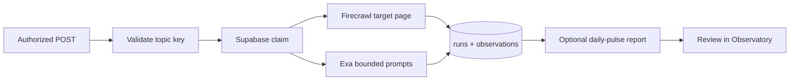
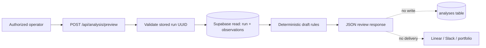

# Manual experiment run

The protected manual runner lets the operator test one of the approved
portfolio topics without waiting for the daily idempotent cron key.

## What it does



The runner accepts a topic key, not an arbitrary URL or prompt. This keeps
manual tests inside the approved experiment set and prevents an operator or
caller from turning the endpoint into an unrestricted proxy.

## Endpoint contract

```text
POST /api/runs/experiment
Authorization: Bearer $CRON_SECRET
Content-Type: application/json
```

Body:

```json
{ "topicKey": "self-improving-website" }
```

Approved topic keys:

- `seo-vs-aeo-portfolio`
- `self-improving-website`
- `github-linear-slack-website-loop`

The response includes the `runId`, `runType`, `topicKey`, run status,
observation count, and report persistence status. A successful run is stored
as `run_type = experiment_retest` with a unique key in the form:

```text
experiment:<topic-key>:<started-at>:<random-id>
```

## Status codes

| Status | Meaning |
|---|---|
| `200` | Collection completed; inspect the returned run in the Observatory |
| `202` | The claim was refused because the key already exists or another observation run is active |
| `401` | Missing or invalid `CRON_SECRET` authorization |
| `422` | Invalid JSON or an unapproved topic key |
| `500` | Collection or report persistence failed; inspect the run and Vercel logs |

## Safe execution sequence

1. Apply `supabase/migrations/20260829120000_add_experiment_run_claim.sql`
   to the approved AEO LOOP Supabase project.
2. Confirm the branch containing this endpoint is deployed to a Vercel
   preview or production environment.
3. Run one topic at a time with the same `CRON_SECRET` already used by the
   protected daily route. Do not paste the secret into shell history or chat.
4. Open `/runs` and the returned `/runs/<runId>` route in the Observatory.
5. Compare Firecrawl inspectability, Exa results, citation status, duration,
   cost, and report persistence with the daily control run.
6. Keep the current SEO/AEO topic as the control when testing a different
   topic. Do not interpret a different topic as a content-lift experiment.

Example using a shell variable already loaded in the operator environment:

```bash
curl -X POST "$AEO_LOOP_URL/api/runs/experiment" \
  -H "Authorization: Bearer $CRON_SECRET" \
  -H "Content-Type: application/json" \
  --data '{"topicKey":"self-improving-website"}'
```

The endpoint does not create Linear issues, send Slack/Zapier messages, edit
portfolio files, or deploy code. Those remain separate human-approved phases.

## Read-only analysis preview

After a run is stored, the operator can inspect the deterministic analysis
without enabling cron persistence:

```text
POST /api/analysis/preview
Authorization: Bearer $CRON_SECRET
Content-Type: application/json
```

Body:

```json
{ "runId": "<stored-run-uuid>" }
```

The response is explicitly `mode = draft_only`. It loads the selected run and
its observations, returns evidence-linked draft findings, and performs no
database write, model call, Linear/Slack/Zapier delivery, portfolio edit, or
deployment. It rejects non-UUID run IDs and does not accept a topic or URL,
which keeps the preview tied to an existing stored run.



This is the next ANT-36 testable slice: it proves the evidence-to-finding
boundary on demand while the durable persistence flag remains disabled.
