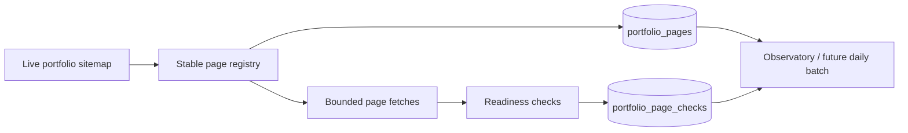

# Portfolio citation-readiness baseline

ANT-113 adds a source-derived inventory and deterministic readiness check for
the public portfolio's `/notes/` and `/insights/` pages.

## What it does



The registry is derived from the sitemap. It does not maintain a second
hand-written list of portfolio URLs. Known legacy hosts are normalised to the
approved canonical host, foreign hosts are ignored, and duplicate paths are
collapsed into one stable `page_key`.

## Readiness signals

Each page receives a score and explicit pass/fail checks for:

- title and meta description;
- canonical URL and robots/indexability;
- H1/H2 answer structure and readable article/main content;
- authorship and publication/update date;
- JSON-LD structured data.

This is a technical/editorial readiness baseline. It does not claim that a
page is cited. Exa retrieval presence and actual AI-answer citation remain
separate provider observations.

## Protected route

```text
POST /api/portfolio/baseline
Authorization: Bearer $CRON_SECRET
```

The route reads `AEO_PORTFOLIO_SITEMAP_URL` when configured, otherwise it uses
`https://www.stephenmantle.com/sitemap.xml`. It fetches at most three pages at
once, times out slow requests, persists the registry and check rows through the
service role, and returns counts for ready, needs-attention, and failed pages.

The route is not included in the daily production schedule yet. Apply the
migration, deploy the reviewed commit, run one protected baseline, inspect the
stored results, then approve the daily multi-page expansion separately.

## Persistence

- `portfolio_pages` owns the current source-derived registry.
- `portfolio_page_checks` owns timestamped readiness results.
- Supabase service role is the only writer; RLS is enabled.
- `registry_digest` links a check to the exact page set used for that run.

## Human interpretation

`ready` means the deterministic checks passed. `needs_attention` means one or
more page signals need review. `failed` means the page could not be fetched.
Neither `ready` nor a successful HTTP response means an AI system will cite the
page. Citation proof requires repeated provider/model observations with a
visible prompt denominator.
